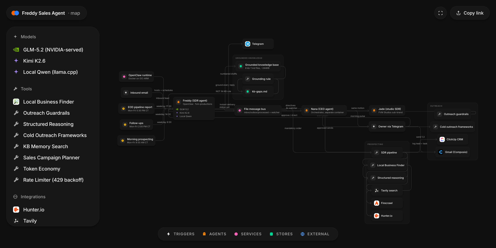

# Freddy Sales Agent

An autonomous SDR and revenue agent for Freddyville Media Productions — it prospects, qualifies, and drafts; a human sends.

*Interactive, pannable version: [open the architecture map](https://fred-in-tech.github.io/fvm-system-maps/freddy-sales-agent/)*

## What it is

Freddy is a production AI sales agent running on the OpenClaw runtime, in Docker on an Oracle Cloud ARM server. Three weekday cron jobs drive a full SDR motion: morning prospecting, afternoon follow-ups, and an end-of-day pipeline report — all delivered to me over Telegram. It is running today in REVIEW mode: Freddy drafts every email, and nothing goes out until I reply "send" on Telegram.

## Why I built it

Freddyville Media is a real video production company, and its bottleneck was never craft — it was consistent outbound. Prospecting, enrichment, CRM hygiene, and follow-up are exactly the kind of structured, repeatable work an agent can own. I wanted an SDR that works every weekday without ever inventing a price, a client, or a fact about my company.

## Architecture

The map above is the real system. The flow:

| Stage | What happens |
|---|---|
| Entry | Three OpenClaw cron jobs (Mon–Fri, America/Chicago), inbound email, and my Telegram commands |
| Discover | Tavily vertical search, plus an OpenStreetMap local-business finder that flags businesses with **no website** — Freddyville's ideal prospect |
| Qualify | Firecrawl scrapes the prospect's site; a structured-reasoning skill scores Strong/Medium/Weak; Weak is dropped |
| Enrich | Hunter.io finds the decision-maker and **verifies the email** — a lead cannot enter the CRM unverified |
| CRM | ClickUp is the system of record: lead, status, source, and a follow-up task with a date |
| Outreach | Drafts built from cold-outreach frameworks and specific research findings, posted to Telegram as numbered drafts |
| Approval | I reply `send`, `send all`, or `send 1,3`; only approved drafts go out via Composio Gmail |

Freddy is one of three agents. A CEO orchestrator agent (Nana) and a studio-side SDR (Jade) run in separate containers; they coordinate over a custom file message bus because Telegram bots cannot see each other's messages.

## Engineering highlights

- **The context-window overflow hunt.** Early on, replies took 6–11 minutes. Root cause: the local model had an 8K context window and the agent's bootstrap prompt measured 8.8K tokens — every turn triggered a compaction loop before a single useful token. The fix was measurement, not vibes: count the prompt, respect the window. This became my go-to war story about context windows being an *ops* problem.
- **Grounding beats prompting.** Freddy carries an 8-file, ~244KB knowledge base built from the real freddyvillemedia.com codebase and adversarially fact-checked (34 corrections found). A hard rule requires a KB search before quoting any price or term, and the mandated answer for anything missing is "NOT IN KB" — not a guess. A dedicated `kb-gaps.md` documents the known unknowns.
- **Autonomy with a money gate.** The `outreach-guardrails` skill is non-negotiable and overrides any instruction to send faster: default REVIEW mode, send caps, suppression list, unsubscribe compliance. AUTO-SEND is deliberately deferred until DMARC hardening and inbox warmup are done — domain reputation over volume.
- **Model migration as an empirical process.** The agent moved local Qwen → Kimi K2.6 → NVIDIA-served GLM-5.2. When a hosted catalog 404'd a model that was still listed, I built a diagnostic rule (404 = retired, 401/403 = key) and chose replacements with a scripted latency/tone test battery, not vibes.
- **Platform quirks decide architecture.** Telegram bots are silent to each other, so agent-to-agent comms run on a file message bus (inbox/outbox/processed per agent) with a 4-second watcher for instant delivery and cron sweeps as backup. The full loop — orchestrator → agent → orchestrator → owner — is verified end to end.
- **Every lead is verified before it exists.** The pipeline order is mandatory and enforced in the tool directive: no CRM entry without a Hunter-verified email, no outreach without a logged lead and a follow-up task.

## Stack

| Layer | Tech |
|---|---|
| Runtime | OpenClaw agent framework, Docker Compose, Oracle Cloud ARM (Ampere) |
| Models | GLM-5.2 (NVIDIA-served); previously Kimi K2.6, local Qwen via llama.cpp |
| Prospecting | Tavily, Firecrawl, Hunter.io, OpenStreetMap (custom Python finder) |
| CRM | ClickUp (system of record) |
| Email | Gmail via Composio, SPF+DKIM verified |
| Approval / comms | Telegram (human-in-the-loop), file message bus (agent-to-agent) |
| Knowledge | 8 grounded `kb-*.md` files + memory search |

## Status & roadmap

Running, in REVIEW mode — drafts only, human approval on every send. Next: DMARC hardening and warmup before enabling capped AUTO-SEND, and moving the remaining local-model dependency fully onto hosted inference so cron jobs never depend on a laptop being awake.

## About this repo

This is a public architecture showcase of a private production codebase. The agent's source, persona files, and knowledge base stay private; this repo documents how the system is built.

— Godfred Aidoo · [godfredaidoo.com](https://godfredaidoo.com) · [LinkedIn](https://www.linkedin.com/in/godfred-aidoo) · [more projects](https://github.com/Fred-In-tech)
